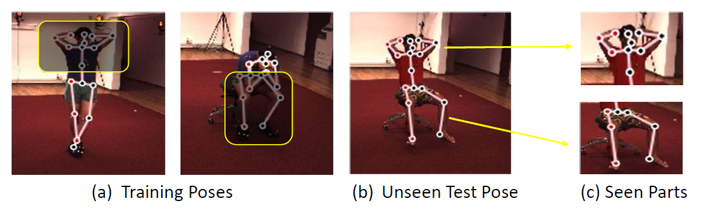
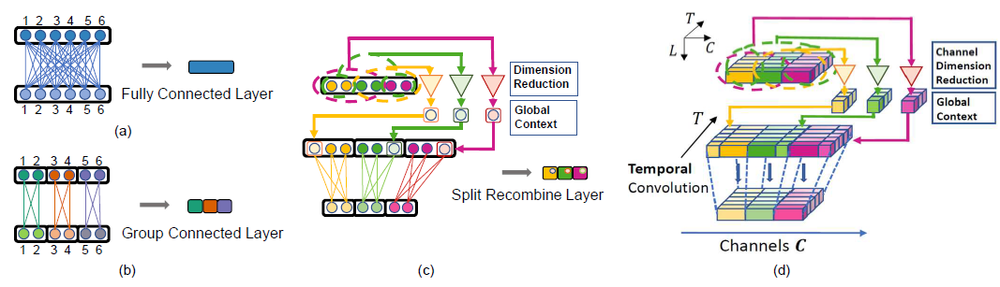
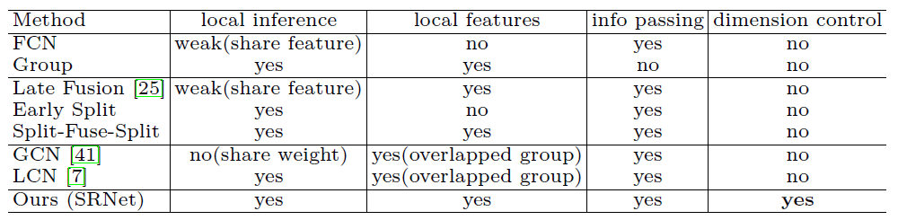

# Split-and-Recombine-Net
This is the original PyTorch implementation of the following work: [SRNet: Improving Generalization in 3D Human Pose Estimation with a Split-and-Recombine Approach](https://arxiv.org/pdf/2007.09389.pdf) in ECCV 2020.

## Features
- [x] Support single-frame setting (e.g., -arc 1,1,1)
- [x] Support multi-frame setting (e.g., -arc 3,3,3,3,3 for 243 frames)
- [x] Support four normalization (--norm {base,proj,weak_proj,lcn})
- [x] Support cross-subject, cross-action, cross-camera settings
- [x] Support [VideoPose3d](https://arxiv.org/abs/1811.11742), [SimpleBaseline](https://arxiv.org/pdf/1705.03098.pdf) as our baseline.

This task is to input 2d poses to lift into 3d relative poses. Take root (index=0) joint as the zero-position under camera coordinate by default.

## Introduction
Human poses that are rare or unseen in a training set are challenging for a network to predict. Similar to the long-tailed distribution problem in visual recognition, the small number of examples for such poses limits the ability of networks to model them. Interestingly, local pose distributions suffer less from the long-tail problem, i.e., local
joint configurations within a rare pose may appear within other poses in the training set, making them less rare.


We propose to take advantage of this fact for better generalization to rare and unseen poses. To be specific, our method splits the body into local regions and processes them in
separate network branches, utilizing the property that a joint's position depends mainly on the joints within its local body region. Global coherence is maintained by recombining the global context from the rest of the body into each branch as a low-dimensional vector. With the reduced dimensionality of less relevant body areas, the training set distribution within network branches more closely reflects the statistics of local poses instead of global body poses, without sacrificing information important for joint inference. The proposed split-and-recombine approach, called SRNet, can be easily adapted to **both single-image and temporal models**, and it leads to appreciable improvements in the prediction of rare and unseen poses.


The comparison of Different network structures used for 2D to 3D pose estimation.



## Get started

To get started as quickly as possible, follow the instructions in this section. It allows you to train a model from scratch, test our pretrained models, and produce basic visualizations. For more detailed instructions, please refer to [DOCUMENTATION.md](https://github.com/facebookresearch/VideoPose3D/blob/master/DOCUMENTATION.md).

### Dependencies
Make sure you have the following dependencies installed before proceeding:

  * Python 3+ distribution 
  * PyTorch >= 0.4.0
  * pip install matplotlib==3.1.1

### Directory

First, we build new files to store models:

```
mkdir checkpoint
mkdir best_checkpoint
```

The ${ROOT} is described as below. 

```${ROOT}  
|-- data/
|-- checkpoint/
|-- best_checkpoint/
|-- common/
|-- config/
|-- run.py
```

### Dataset preparation

Please follow the instruction from [VideoPose3D](https://github.com/facebookresearch/VideoPose3D/blob/main/DATASETS.md) to process the data from the official [Human3.6M](http://vision.imar.ro/human3.6m/description.php) website.
You can download the processed skeleton-based Human3.6M datasets in the [link](https://drive.google.com/drive/folders/17kXk6rK84-wdDTc1LLemlHZIvFQy4oKj?usp=sharing). Put the data into the dictory data/.
```
mkdir data
cd data
```

The data directory structure is shown as follows. 
```
./
└── data/
    ├── data_2d_h36m_gt.npz
    ├── data_3d_h36m.npz 
```

`data_2d_h36m_gt.npz` is the 2d ground-truth pose of Human3.6M dataset.

`data_3d_h36m.npz` is the 3d ground-truth pose of Human3.6M dataset.

### Pretrain Model
We provide single-frame and multi-frame models in the [link](https://drive.google.com/drive/folders/11HhwYZpYhMMK7IdlyFekDqZB9ii9BA53?usp=sharing) for inference and finetune:

Pretrained models should be put in the `checkpoint/` \
e.g.,
`latest_epoch_fc.bin` is the last checkpoint of the [fully connected network](https://arxiv.org/pdf/1705.03098.pdf)\
`latest_epoch_sr.bin` is the last checkpoint with 1 frame of the [split-and-recombine network](https://arxiv.org/pdf/2007.09389.pdf)\
`srnet_gp5_t243_mul.bin` is the last checkpoint with 243 frames of the [split-and-recombine network](https://arxiv.org/pdf/2007.09389.pdf)

### Inference
Using **--evaluate {model_name}** for testing the model. \
Using **--resume {model_name}** for resuming some checkpoint to finetune the model.

For example:
```
python run.py -arc 3,3,3,3,3 --model srnet --evaluate srnet_gp5_t243_mul.bin
python run.py -arc 1,1,1 --model srnet --evaluate latest_epoch_sr.bin
python run.py -arc 1,1,1 --model fc --evaluate latest_epoch_fc.bin
```
 
### Training

There are three training and test settings, the commonly used is the **cross-subject** (by default). We train on **five subjects** with all four cameras and all fifteen actions and test on other **two subjects** with all cameras and all actions. \
To train the [split-and-recombine network](https://arxiv.org/pdf/2007.09389.pdf) with 243 frames as input and 1 frames as output from the scratch, run:

```
python run.py -arc 3,3,3,3,3 --model srnet -mn {given_model_name} 
```
`-mn` is the model name to save the specific model.

To train the [VideoPose3d](https://arxiv.org/abs/1811.11742) with 243 frames as input and 1 frames as output from the scratch, run:
```
python run.py -arc 3,3,3,3,3 --model fc -mn {given_model_name} 
```

To use **cross-action** setting, we train on only **one action** with all subjects and all cameras, and test on other **fourteen actions** with all subjects and all cameras.

You can add the arguments in the command like: `--use-action-split True --train-action Discussion` 

To use **cross-camera** setting, we train on only **one camera** with all subjects and all actions, and test on other **three cameras** with all subjects and all actions.

You can add the arguments in the command like: `--cam-train [0] --cam-test [1,2,3]` 

For convenience of different hyper-parameter settings, you can edit the scipt **run_os.py** to run experiments for once.
#### We also put some configuration examples in the dictory config/. To facilitate reproduction, we provide the training logs for single-frame and multi-frame settings [here](https://drive.google.com/drive/folders/1Z1xZt9n749cW89eKPcR4WJ8RgRS3ar-8?usp=sharing). You can check **the hyperparameters, training loss and test results for each epoch** in these logs as well.

 If you find this repository useful for your work, please consider citing it as follows:

```
@inproceedings{Zeng2020SRNet,
  title={SRNet: Improving Generalization in 3D Human Pose Estimation with a Split-and-Recombine Approach},
  author={Ailing Zeng and Xiao Sun and Fuyang Huang and Minhao Liu and Qiang Xu and Stephen Ching-Feng Lin},
  booktitle={ECCV},
  year={2020}
}
```
